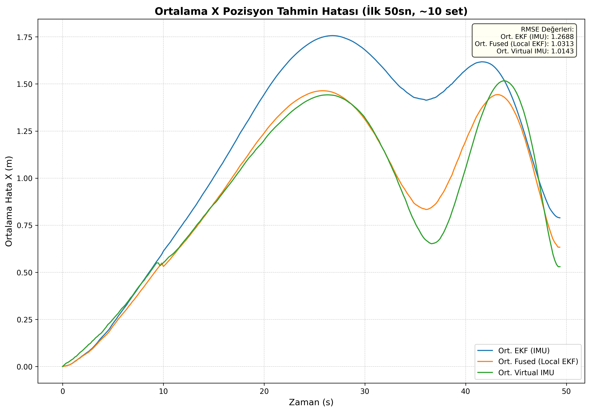
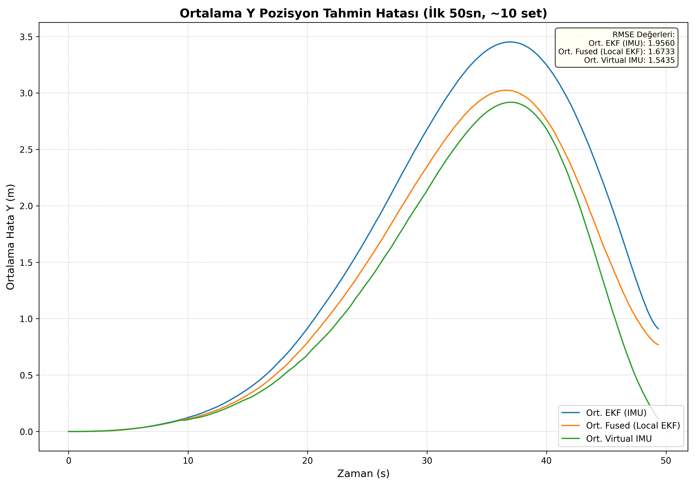

# Çoklu IMU Veri Füzyonu ile ROS 2'de Robot Konumlandırma

## Projeye Genel Bakış

Bu proje, bir mobil robotun konum ve yönelim tahminini (pose estimation) iyileştirmek amacıyla çoklu Atalet Ölçüm Birimi (IMU) sensör verilerinin füzyonunu inceler. Simülasyon ortamı olarak ROS 2 ve Gazebo kullanılmıştır. Projenin temel amacı, `robot_localization` paketi içerisinde yer alan Genişletilmiş Kalman Filtresi (EKF) kullanarak, tek bir IMU'ya kıyasla birden çok IMU verisini birleştirmenin konumlandırma doğruluğuna olan etkisini göstermektir.

## Karşılaştırmalı Veri Füzyon Mimarileri

Bu çalışmada, aynı fiziksel noktada konumlandırıldığı varsayılan bir IMU diziliminin (IMU array) sağlayacağı doğruluk artışı, **iki farklı veri füzyon mimarisi** altında karşılaştırmalı olarak analiz edilmektedir:

### 1. Sensör Seviyesinde Füzyon (*Sanal IMU Yaklaşımı*)

* **Prensip:** Birden çok IMU'dan gelen ham ivme ve açısal hız verileri, istatistiksel olarak birleştirilir (ortalaması alınır).
* **Amaç:** Gürültüsü azaltılmış, daha güvenilir ve tek bir **"sanal IMU"** veri akışı oluşturmak.
* **Uygulama:** Bu birleştirilmiş sanal IMU verisi, Genişletilmiş Kalman Filtresi'ne (EKF) tek bir sensör girdisi olarak sunulur.
* **Sorumlu Düğüm:** Bu yöntem, `virtual_imu_publisher.py` düğümü ile gerçeklenmiştir.

### 2. Durum/Tahmin Seviyesinde Füzyon (*Pose Averaging Yaklaşımı*)

* **Prensip:** Her bir IMU verisi *ayrı bir EKF'ye* beslenir.
* **Amaç:** Her bir sensör için bağımsız bir konum tahmini (`pose`) elde etmek.
* **Uygulama:** Nihai robot konumu, her bir filtreden gelen bu bağımsız konum tahminlerinin istatistiksel ortalaması alınarak hesaplanır.
* **Sorumlu Düğüm:** Bu yaklaşım, `pose_prediction.py` düğümü tarafından yönetilmektedir.

### Anahtar Özellikler

* **ROS 2 & Gazebo Simülasyonu:** `pilbot` adında bir diferansiyel sürüşlü robot modeli içerir.
* **Çoklu Sensör Füzyonu:** `robot_localization` paketini kullanarak çoklu IMU verisini EKF filter altında birleştirir.
* **Sanal IMU Üretimi:** Birden fazla IMU verisi birleştirilerek tek bir topic altında bunları yayınlayan node (`virtual_imu_publisher.py`).
* **Performans Analizi:** Filtrelenmiş EKF çıktısı ile Gazebo tarafından sağlanan "ground truth" poz verisini karşılaştırarak konumlandırma hatasını analiz etmek için yapılmış bir projedir.

---

## 🛠️ Test Sonuçları
* **Test Açıklama:** Testler, her iki saniyede hızı %10 artan bir aracın 90 saniye boyunca daire çizmesi sonucu oluşturulmuştur. Max lineer hız: 5.2 m/s, Max. angular hız: 1.2 m/s'dir. Araç hız limitlerine ulaşınca ani frenleme yapıp, hızı %50 azaltılmıştır
* **X Eksenindeki Hata Grafiği:** 
* **Y Eksenindeki Hata Grafiği:** 

---

## Proje Yapısı

Proje, standart bir ROS 2 çalışma alanı (workspace) yapısında düzenlenmiş çeşitli paketlerden oluşur:
* `pilbot_bringup`: Simülasyonu ve tüm gerekli düğümleri başlatan ana launch dosyalarını içerir.
* `pilbot_description`: Robotun URDF modelini ve Gazebo eklentilerini barındırır.
* `pilbot_controller`: Robotun hareketi için bir kontrolcü ve "ground truth" poz verisini yayınlayan düğümleri içerir.
* `pilbot_localization`: EKF yapılandırmasını (`ekf.yaml`), sanal IMU üreticisini ve analiz için kullanılan veri kaydedici/çizdirici betikleri içerir.
* `pilbot_msgs`: Projeye özel mesaj türleri için tasarlanmıştır (şu an için boş).

## Kurulum ve Bağımlılıklar

1.  **ROS 2 Kurulumu:** ROS 2 Humble (veya daha güncel bir sürüm) ve Gazebo'nun kurulu olması gerekmektedir.
2.  **Gerekli Paketler:** `robot_localization` paketinin kurulu olduğundan emin olun:
    ```bash
    sudo apt update
    sudo apt install ros-humble-robot-localization
    ```
3.  **Çalışma Alanını Oluşturma:**
    ```bash
    mkdir -p ros2_ws/src
    cd ros2_ws/src
    # Bu repoyu klonlayın veya dosyaları buraya kopyalayın
    cd ..
    rosdep install -i --from-path src -y --skip-keys "pilbot_controller pilbot_description pilbot_localization pilbot_bringup pilbot_msgs"
    colcon build
    ```

## Simülasyonu Çalıştırma

1.  Çalışma alanını kaynak gösterin:
    ```bash
    source install/setup.bash
    ```
2.  Ana launch dosyasını çalıştırın:
    ```bash
    ros2 launch pilbot_bringup start_simulation.launch.py
    ```
